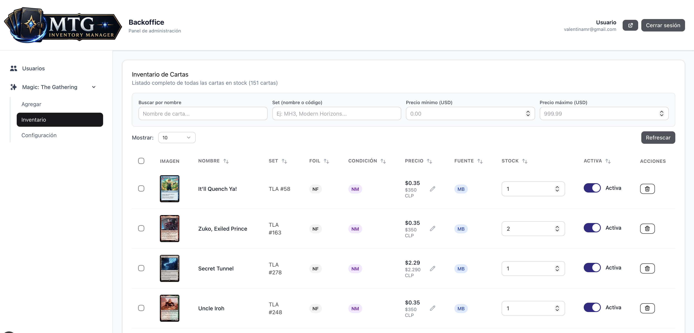

# MTG Inventory Manager

Sistema de gestión de inventario y catálogo de cartas Magic: The Gathering orientado a coleccionistas, vendedores y flujos de compra/venta basados en precios reales de mercado.

El proyecto nació a partir de una necesidad concreta: convertir una colección registrada en ManaBox en un catálogo propio, público y administrable, con imágenes, características de las cartas y precios actualizados desde CardKingdom.

## Características principales

- Importación de colección desde CSV exportado de ManaBox
- Catálogo público de cartas
- Backoffice privado para administración
- Búsqueda y filtros por características de carta
- Matching automático de cartas entre distintas fuentes
- Homologación de identificadores entre ManaBox, Scryfall y MTGJson
- Visualización de imágenes y datos de cartas desde Scryfall
- Actualización de precios desde CardKingdom mediante MTGJson
- Sincronización automática semanal de precios
- Gestión de matriz de identificadores para nuevos sets

## Cómo funciona

El sistema combina:

- Inventario exportado desde ManaBox
- Datos e imágenes de cartas desde Scryfall
- Matriz de identificadores desde MTGJson
- Precios de mercado de CardKingdom expuestos mediante MTGJson
- Procesos internos de importación, normalización y sincronización

para construir un catálogo consultable con precios actualizados.

El flujo principal es:

1. Exportar la colección desde ManaBox como archivo CSV
2. Importar el CSV en el backoffice
3. Hacer match automático de cartas usando identificadores y metadata
4. Completar la información visual y descriptiva desde Scryfall
5. Sincronizar precios de CardKingdom mediante MTGJson
6. Publicar el catálogo actualizado para consulta o venta

## Arquitectura

El proyecto integra varios componentes:

- Frontoffice público para visualizar el catálogo
- Backoffice privado para importar cartas y administrar sincronizaciones
- Proceso de importación CSV
- Proceso de homologación de identificadores
- Sincronización de precios
- Base de datos centralizada
- Automatización semanal mediante cron
- Integración con APIs externas y archivos públicos de datos

## Stack tecnológico

### Frontend

- Next.js 16
- React 19
- TypeScript
- Tailwind CSS 4.3

### Backend / Base de datos

- Supabase Auth
- Supabase Database
- PostgreSQL

### Datos e integraciones

- Scryfall API
- MTGJson
- MTGJson AllPrintings
- MTGJson AllPricesToday
- PapaParse

### Automatización

- GitHub Actions
- Cron semanal para actualización de precios

## Motivación

ManaBox permite registrar una colección y consultar precios, pero no ofrece una API pública pensada para construir un catálogo propio.

Scryfall ofrece imágenes y datos completos de cartas, mientras que MTGJson permite acceder a identificadores y precios de CardKingdom. El problema real fue unir esas fuentes de forma confiable:

> ¿Cómo construir un catálogo propio cuando cada fuente usa su propio sistema de identificadores?

Este proyecto resuelve ese punto mediante una capa de homologación que permite cruzar inventario, metadata, imágenes y precios actualizados.

## Estado actual

Sistema funcional en desarrollo continuo.

Actualmente permite importar cartas desde ManaBox, cruzar datos con Scryfall y MTGJson, actualizar precios desde CardKingdom y visualizar la colección en un catálogo público con filtros.

## Capturas

### Frontoffice

### Backoffice

## Roadmap

- Incorporar dashboard de valorización de colección
- Permitir exportación del catálogo
- Agregar modo vendedor con disponibilidad y estado de venta

## Demo pública

El catálogo puede consultarse públicamente cuando existe una colección cargada.

El backoffice es privado y requiere autenticación para importar cartas, actualizar identificadores y ejecutar procesos de sincronización.
